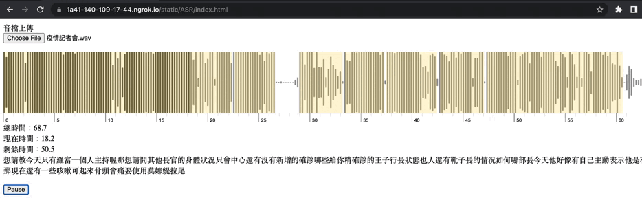
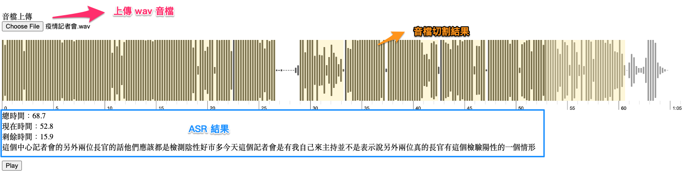

# ASR+VAD

## 使用說明
檔案上傳後，等待片刻將會取得一串連續音檔 VAD 語音活性檢測結果。如圖黃色區域及代表偵測到人聲的區段，接著將每個子音檔利用 Google 免費語音辨識[服務](https://pypi.org/project/SpeechRecognition/)，將語音轉成文字。

## Reference
- [WAV to Base64 data stream encoder](https://codepen.io/rannmann/pen/xOEwOq)
- [andy6804tw/VAD-API](https://github.com/andy6804tw/VAD-API)
- [1010code/streamlit-vad-app](https://github.com/1010code/streamlit-vad-app)